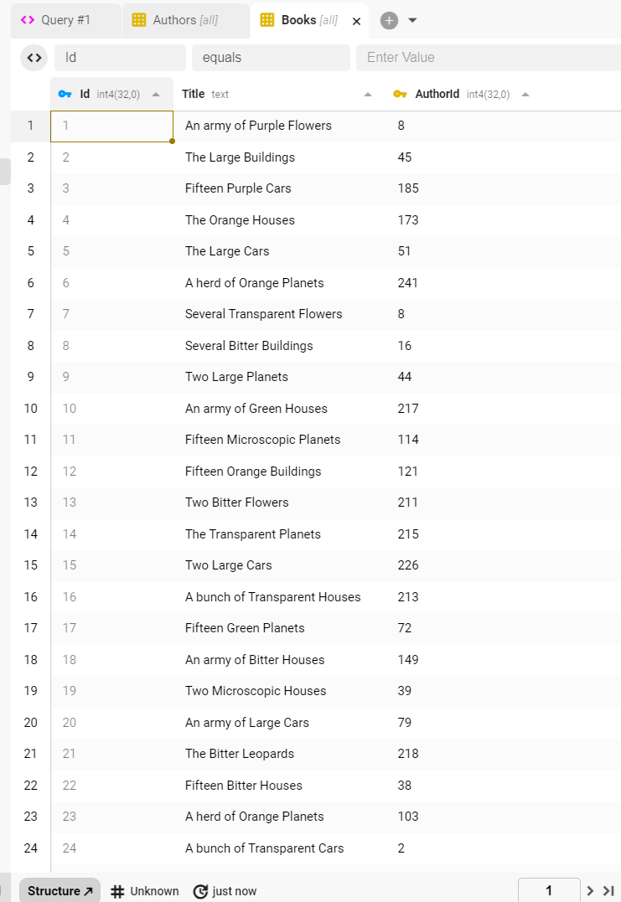

Extension: 

"Swap out he InMemory db for another Postgres instance such as neon. Make sure you have appsettings.json AND appsettings.Development.json files in the root of the workshop.wwwapi project which contains suitable credentials. You may modify the seeding process if you need to."

Switched from inmemory to Postgres:

```csharp
optionsBuilder.UseNpgsql("Name=DefaultConnectionString");
```


